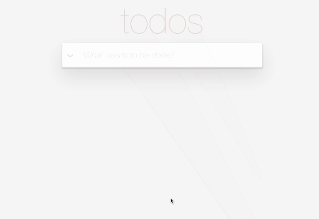

# To Do App

#### By Egemen Kar

## Preview

## Description

It's the second assignment of Patika React curriculum. It's the React version of this [to-do app](https://codepen.io/dmitrysharabin/pen/MWgQNYZ). 

You can add, complete and delete todos. This app uses localstorage to create/read/delete.

## Setup/Installation Requirements & License etc.

Check the main [README](../README.md)
