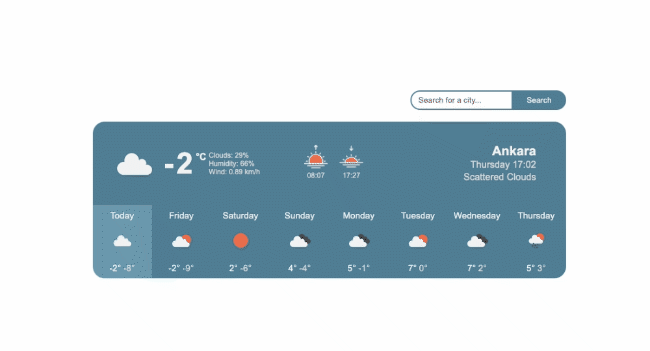

# Weather App

#### By Egemen Kar

## Preview

## Description

It's the third assignment of Patika React curriculum. It's a weather app.

You can search for a city to get the current and next 7 days' forecast.

It uses [Open Weather Api](https://openweathermap.org/api) to get weather data.

Technologies used: React, Axios, NodeJS

## Setup/Installation Requirements & License etc.

Check the main [README](../README.md)
